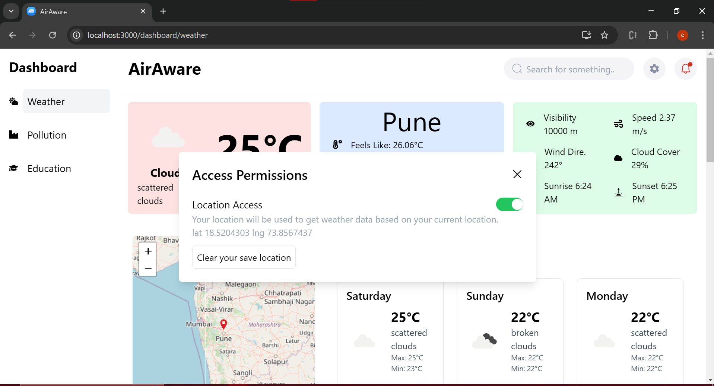
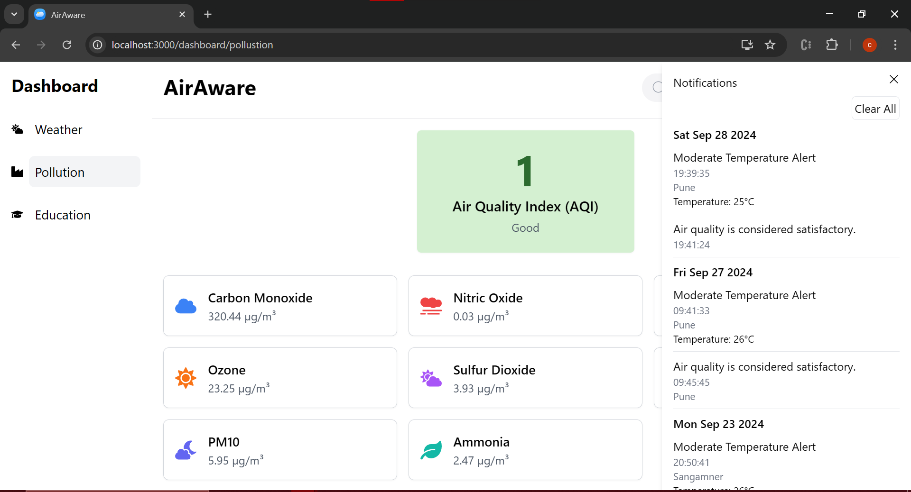
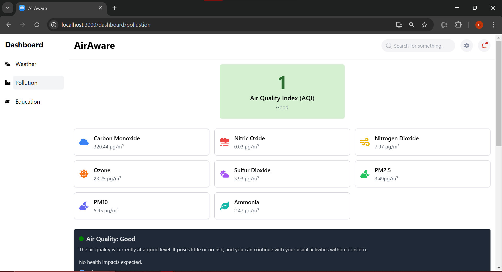
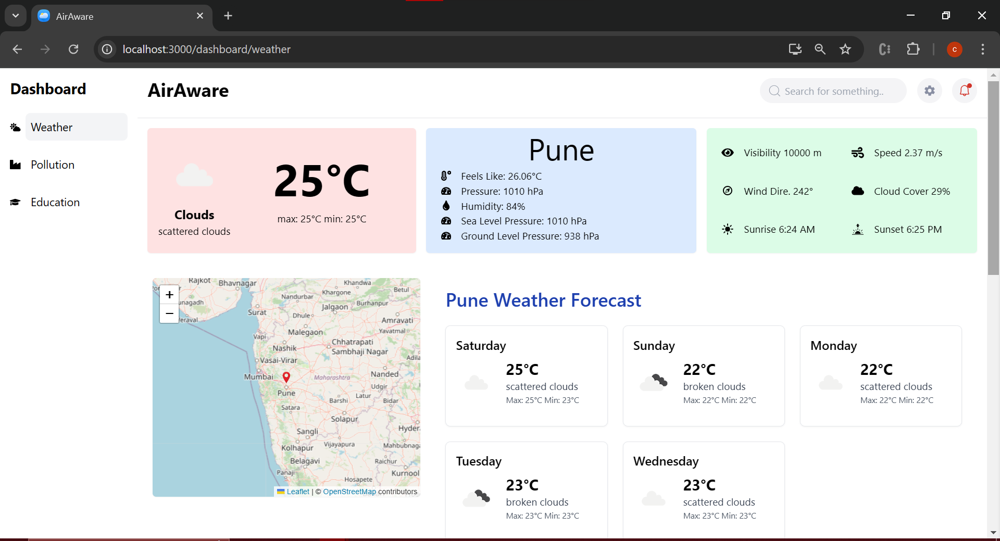

---

# AirAware Weather Update

A comprehensive web application providing real-time weather updates, air quality index (AQI) data, pollution protection tips, and educational content related to environmental health. AirAware aims to keep users informed of environmental conditions that impact their health.

## 🚀 Live Demo
[Live Demo](#) - *(https://reactjs-projects-gold.vercel.app/)*

## 📸 Screenshots
1. **Home Page**:
   - 
2. **Education Page**:
   -  
3. **Updates Forecast Page**:
   -  
4. **Location Page**:
   -  
5. **Notifications Page**:
   -  
5. **Pollution Page**:
   - 
5. **Wheather Page**:
   - 

---

## 📝 Table of Contents
- [Features](#features)
- [Project Structure](#project-structure)
- [Installation](#installation)
- [Usage](#usage)
- [Technologies Used](#technologies-used)
- [Features](#features)
- [Contributing](#contributing)
- [License](#license)

---

## ✨ Features

- **Real-Time Weather Updates**: Displays real-time weather conditions, including temperature, humidity, and wind.
- **Air Quality Index (AQI)**: Provides AQI data with user-friendly suggestions for better health protection.
- **Educational Content**: Offers educational resources on climate, air pollution, and protective measures.
- **Pollution Protection Tips**: Shares safety tips based on the current pollution level.
- **Notifications**: Local notifications to alert users regarding important updates like poor weather or pollution conditions.
- **Offline Mode Notification**: Alerts users when they go offline.

---

## 🗂️ Project Structure

The project structure is as follows:

```
src
│
├── components
│   ├── dashboard
│   │   ├── education
│   │   │   ├── Contents.jsx
│   │   │   ├── Header.jsx
│   │   │   └── Lodder.jsx
│   │   ├── pollution
│   │   │   ├── Aqi.jsx
│   │   │   └── UserProtectionPollution.jsx
│   │   └── weather
│   │       ├── Map_Forcast.jsx
│   │       ├── UserProtect.jsx
│   │       └── WheatherData.jsx
│   │
│   ├── home
│   │   ├── DieaseCard.jsx
│   │   ├── Feature.jsx
│   │   ├── HelpSection.jsx
│   │   ├── Hero.jsx
│   │   └── ImpactSection.jsx
│   │
│   ├── layout
│   │   ├── Footer.jsx
│   │   └── Nav.jsx
│   │
│   ├── setting
│   │   └── Notifications.jsx
│   │
│   ├── Sidebar.jsx
│   └── images
│
├── json
│   ├── AQI.json
│   ├── Language.json
│   └── TempData.json
│
├── pages
│   ├── Dashboard.jsx
│   ├── Education.jsx
│   ├── Home.jsx
│   ├── Pollution.jsx
│   └── Weather.jsx
│
├── redux
│   ├── permissions
│   │   └── Location.js
│   ├── NotificationSlice.js
│   ├── PollutionSlice.js
│   ├── SearchValueSlice.js
│   ├── WeatherApiSlice.js
│   └── WeatherForecastSlice.js
│
├── store.js
├── App.js
└── index.js
```

---

## 🛠️ Installation

1. Clone the repository:
   ```bash
   git clone https://github.com/your-username/airaware-weather-update.git
   ```
2. Navigate to the project folder:
   ```bash
   cd airaware-weather-update
   ```
3. Install dependencies:
   ```bash
   npm install
   ```
4. Create a `.env` file in the root directory and add the following:
   ```env
   REACT_APP_WEATHER_API_KEY=your_openweathermap_api_key
   ```
5. Start the development server:
   ```bash
   npm start
   ```

---

## 🚀 Usage

- **Home Page**: Overview of AirAware features.
- **Dashboard**: Access to weather updates, pollution details, and education resources.
- **Weather Forecast**: Provides current weather conditions and forecast data.
- **Pollution Information**: Displays the AQI and suggests protective measures.
- **Education Section**: Learn about the effects of pollution and how to protect yourself.

---

## 🧰 Technologies Used

- **Frontend**: React, JavaScript, HTML, CSS
- **State Management**: Redux Toolkit
- **Styling**: CSS Modules, Styled Components
- **APIs**: OpenWeatherMap API for weather and pollution data
- **Libraries**: 
  - `react-router-dom` for routing
  - `react-hot-toast` for notifications
  - `axios` for HTTP requests

---

## 🤝 Contributing

Contributions are welcome! Please follow these steps to contribute:

1. Fork the repository.
2. Create a new branch (`git checkout -b feature-branch`).
3. Commit your changes (`git commit -m 'Add some feature'`).
4. Push to the branch (`git push origin feature-branch`).
5. Create a Pull Request.

---

## 📜 License

This project is licensed under the MIT License. See the [LICENSE](LICENSE) file for more details.

---
